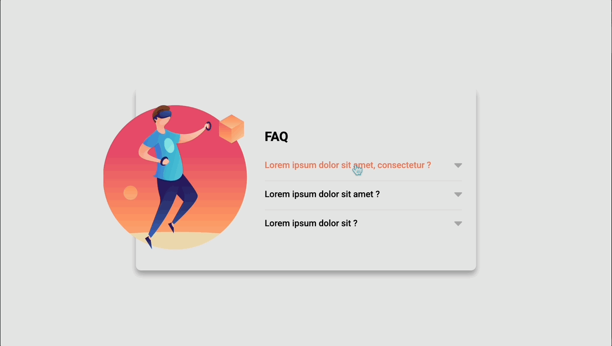

# FAQ Prototype Template

Projeto criado como forma de treinamento no curso DevQuest. 👾

## Requisitos

- Ao clicar em uma pergunta, deve acontecer
uma animação de acordeon para abrir o item
e mostrar o texto escondido, e a seta deve
mudar de cor

- Ao clicar em um item para abri-lo, todos os
outros itens devem ser fechados

## Tecnologias utilizadas

- HTML

- CSS

- JavaScript

## Aprendizado

- Aprendi a manipular o evento de clique, de modo que seja possível fechar todos os outros itens ao clicar em uma pergunta

## Preview do site

